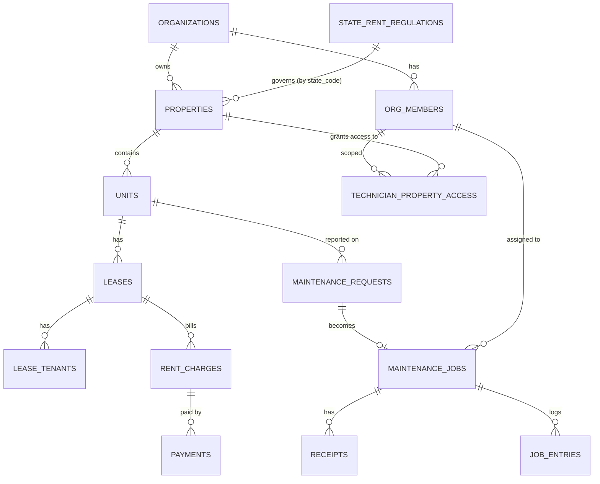

# Property Management App — Domain Model (Draft)

Status: draft for review, no code yet. Payment processor decision: **Stripe
+ Stripe Connect** (see conversation history — Dwolla's self-serve pricing
was discontinued, current plans start at $1,500/mo enterprise contracts).

Designed multi-tenant from day one (`organizations`) even though the only
organization at launch is Chris's own — retrofitting multi-tenancy later
is a much bigger job than including it now.

## Entities

### organizations
The landlord "account." One row today (Chris's rentals); more if this
becomes a product for other landlords.
- id, name, stripe_connect_account_id, created_at

### org_members
Join table between `auth.users` (Supabase Auth) and an organization, with
a role. Every person who logs in — including tenants — has a row here.
- id, organization_id, user_id, role (`admin` | `property_manager` |
  `technician` | `tenant`), status (`invited` | `active` | `disabled`),
  invited_by, created_at

Role lives here (not on the user) so the same person could in theory hold
different roles in different orgs later, and so removing someone from an
org is a status flip, not a delete.

### properties
- id, organization_id, name, address_line1, city, state, zip,
  purchase_date, notes, created_at

### units
A property has 1..N units. Your 3 houses / 9 units case is the normal
case, not an edge case.
- id, property_id, label (e.g. "Unit A"), bedrooms, bathrooms, sqft,
  status (`vacant` | `occupied` | `maintenance`), created_at

### leases
- id, unit_id, start_date, end_date, rent_amount, rent_due_day,
  deposit_amount, status (`pending` | `active` | `ended`), document_url,
  late_fee_auto_apply (bool), late_fee_type (`flat` | `percent`),
  late_fee_amount, late_fee_grace_days, fee_payer (`landlord` | `tenant`),
  created_at

Late fee fields live per-lease (not hard-coded org-wide) so each
lease can opt in/out — matching how TurboTenant lets you toggle it, off
by default. When `late_fee_auto_apply` is true, a scheduled job adds a
late-fee `rent_charge` once a charge is unpaid past `late_fee_grace_days`.
When false, the Property Manager applies one manually (just inserts a
`rent_charges` row of type `late_fee`).

**Rent-law limits vary by state and must not be hardcoded.** You're in
Kentucky now (max late fee 10% of rent, no charge before 5 days late —
KRS 383.565), but since this app is meant to potentially run in any
state, KY's numbers can't be baked in as constants — they'd be silently
wrong for a landlord in a state with different (or no) caps.

### state_rent_regulations
A lookup/reference table, not per-lease data — one row per state,
maintained as data so it can be updated without a code change.
- id, state_code, max_late_fee_type (`percent` | `flat` | `none`),
  max_late_fee_value (nullable — null when uncapped), min_grace_days,
  tenant_paid_processing_fee_allowed (bool, nullable = unknown/unverified),
  source_citation, last_verified_at

When a lease is created, the app resolves `late_fee_amount` /
`late_fee_grace_days` bounds and the `fee_payer` default from the
property's state via this table, instead of a fixed default. **A state
with no row (unverified) should fail safe** — block auto-late-fees and
default `fee_payer` to `landlord` until someone confirms that state's
rules, rather than silently assuming Kentucky's numbers or assuming no
limit applies. This table is legal reference data, not legal advice —
worth a real lawyer/compliance pass before onboarding landlords outside
Kentucky, but the schema shouldn't force a rewrite when that happens.

`fee_payer` controls who absorbs the Stripe processing fee at checkout
(defaults to `tenant` for your Kentucky leases now, per your answer, via
the lookup above once it's seeded — not a global constant). It must be
**disclosed in the lease document**, not applied silently at checkout —
an undisclosed fee risks being read as a disguised rent increase, and a
few states restrict payment surcharges outright (hence
`tenant_paid_processing_fee_allowed` above).

### lease_tenants
Join table — supports multiple tenants (roommates/spouses) on one lease.
- id, lease_id, user_id, is_primary, created_at

### rent_charges
The billing ledger — one row generated per lease per period.
- id, lease_id, charge_type (`rent` | `late_fee` | `other`), due_date,
  amount, amount_paid, status (`pending` | `paid` | `partial` | `late`),
  created_at

`amount_paid` tracks partial payments — a charge can take multiple
`payments` rows against it (e.g. tenant pays half now, rest later) until
`amount_paid` reaches `amount`, at which point status flips to `paid`.

### payments
- id, lease_id, tenant_user_id, rent_charge_id, amount,
  processing_fee_amount, total_charged, method (`ach` | `card`),
  stripe_payment_intent_id, status (`pending` | `succeeded` | `failed` |
  `refunded`), paid_at, created_at

`amount` is what applies to the `rent_charge` (the landlord's rent
proceeds); `processing_fee_amount` is Stripe's cut, passed through to
the tenant when `fee_payer = tenant`; `total_charged` = the two summed,
i.e. what actually gets debited from the tenant's account. Keeping these
separate means the rent ledger (`rent_charges.amount_paid`) never gets
polluted by the fee, and the tenant sees an itemized breakdown
(rent + fee) at checkout instead of a mystery total.

### maintenance_requests
Tenant-initiated service requests.
- id, unit_id, submitted_by, category, description, priority, status
  (`open` | `assigned` | `in_progress` | `completed` | `closed`),
  photo_urls[], created_at, updated_at

### maintenance_jobs
Work orders — may originate from a tenant request or be created directly
(e.g. proactive maintenance, not tenant-initiated).
- id, organization_id, property_id, unit_id, request_id (nullable),
  assigned_technician_id, status, scheduled_date, completed_date, notes,
  created_at

### job_entries
What the technician actually logs against a job: labor time, mileage,
materials.
- id, job_id, technician_id, entry_type (`labor` | `mileage` |
  `material` | `note`), description, hours, miles, cost, created_at

### receipts
Photo capture of a purchase, tied to a job (and optionally a specific
entry).
- id, job_id, entry_id (nullable), uploaded_by, image_url, vendor,
  amount, created_at

### messages
Threaded communication. Two natural thread types: PM↔tenant (scoped to a
lease) and PM↔technician (scoped to a job).
- id, organization_id, thread_type (`lease` | `job`), thread_ref_id,
  sender_id, body, created_at, read_at

### technician_property_access
Controls which properties a technician can see/be assigned jobs on.
- id, org_member_id (the technician), property_id (nullable — null means
  "all properties," a row per property means scoped access)

Simplest rule: if a technician has zero rows here, they default to
**no** access (safe default); Admin/PM grants either specific properties
or an "all properties" row (`property_id = null`) per technician. This
gives you the "depends on the technician" flexibility — one guy handles
everything, another only handles the property he's already familiar
with.

### invites
- id, organization_id, email, role, lease_id (nullable — set when
  inviting a tenant, so the invite is pre-bound to their unit), token,
  status, created_at, expires_at

### documents
Generic file attachments (signed leases, insurance, W9s).
- id, organization_id, related_type, related_id, url, label,
  uploaded_by, created_at

## Relationships

`state_rent_regulations` is keyed by `state_code`, not a hard foreign
key on `properties` — it's a lookup joined at read/write time, so
seeding a new state's row never requires touching existing property
rows. At launch, only Kentucky needs to be seeded and verified; every
other state stays in the fail-safe "unverified" state until someone
checks it before you sign a landlord there.

## Role → capability matrix

| Capability | Admin | Property Manager | Technician | Tenant |
|---|---|---|---|---|
| View business analytics (income/expense, occupancy) | ✅ | ✅ | ❌ | ❌ |
| Add/remove properties & units | ✅ | ❌ | ❌ | ❌ |
| Add/remove technicians & PMs | ✅ | ❌ | ❌ | ❌ |
| Invite tenants | ✅ | ✅ | ❌ | ❌ |
| View lease & rent-status for all tenants | ✅ | ✅ | ❌ | own only |
| Message tenants | ✅ | ✅ | ❌ | own PM only |
| Create/assign maintenance jobs | ✅ | ✅ | ❌ | ❌ |
| Log job work (labor/mileage/materials/receipts) | ✅ | view only | ✅ (own jobs) | ❌ |
| Submit maintenance request | ❌ | on behalf of tenant | ❌ | ✅ |
| Make rent payment | ❌ | ❌ | ❌ | ✅ |
| View own lease/balance | — | — | — | ✅ |

## Decisions (resolved 2026-09-01)

1. Property Manager sees full financial analytics, same as Admin.
2. Property Manager can invite tenants (not Admin-only).
3. Technician property access is configurable per technician — see
   `technician_property_access` above.
4. Partial payments are allowed against a `rent_charge`.
5. Late fees are configurable per lease — auto-apply toggle, off by
   default (matches TurboTenant behavior), Property Manager can apply
   manually when off.

## Not modeled yet (deliberately deferred)

- Tenant applications/screening (pre-lease) — out of scope unless you
  want it.
- Lease renewals/rent increases as a distinct workflow vs. just editing
  the lease row.
- 1099 generation for technicians (relevant once technicians are paid
  through the app rather than just logging expenses).
